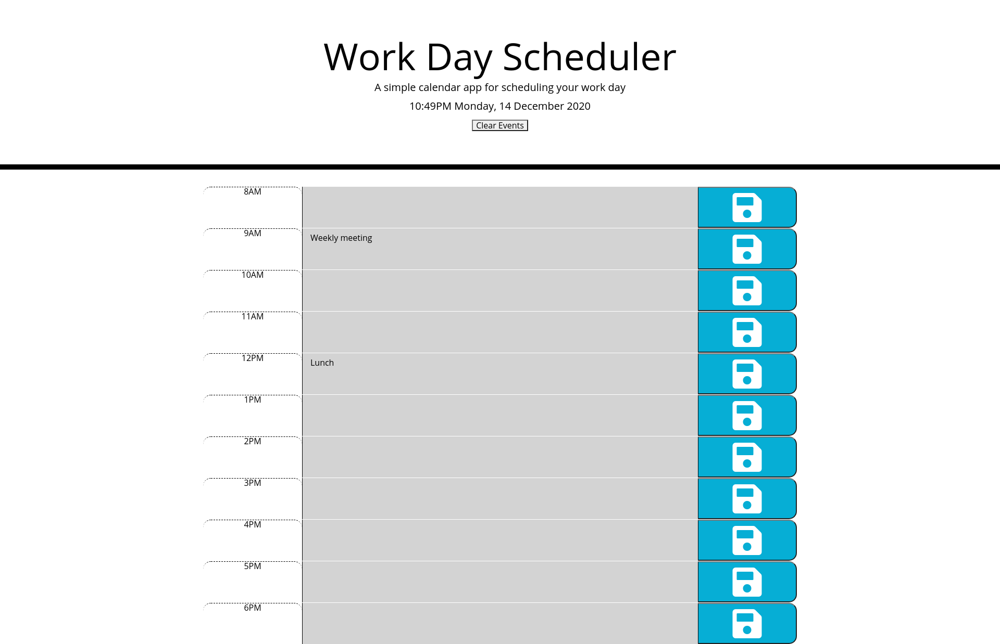

# daily-planner
This program is a workday planner that runs in the browser.

[Project Links]

Deployed application: https://balokdecoy.github.io/daily-planner/ 

Github repo: https://github.com/balokdecoy/daily-planner

[Project Screenshots]

;

[User Instructions and Program Logic]

Project is a daily workday planner

On opening the application, user is provided the current date and time. 

Application displays typical work hours in rows -- 8AM through 6PM. 

Each hour row contains a text box and a save button. 

Hour blocks are color coded: 

1. Green: Future hours
2. Red: Present hour
3. Gray: Past hours

User enters their daily events in the text box. User must click the save button to record the event in local storage, which will allow the event to persist upon reloading the page. 

If user wishes to delete all events, they can click the Clear Events button at the top of the page. This clears events both in local storage and in the text boxes. 

[Acknowledgments]

The basic framework of the HTML and CSS are starter code provided by GWU with my modifications.

Thanks to Amir Ashtiany, Young Ji Kim, Beatrice Ellingson, Frankie Rosado, Rachel Wanke, and John Toth for their feedback, support, and brainstorming. Visit their Github pages here:

1. Amir Ashtiany - https://github.com/Alexfit4
2. Young Ji Kim - https://github.com/youjmi
3. Beatrice Ellingson - https://github.com/beatricellingson
4. Frankie Rosado - https://github.com/Franciscorosado09
5. Rachel Wanke: - https://github.com/rwanke14 
6. John Toth: - https://github.com/jtoth7824 

In particular, Amir Ashtiany provided assistance/correction with the local storage code at lines 112 - 116. John Toth provided assistance with properly nesting the column loop within the row loop.